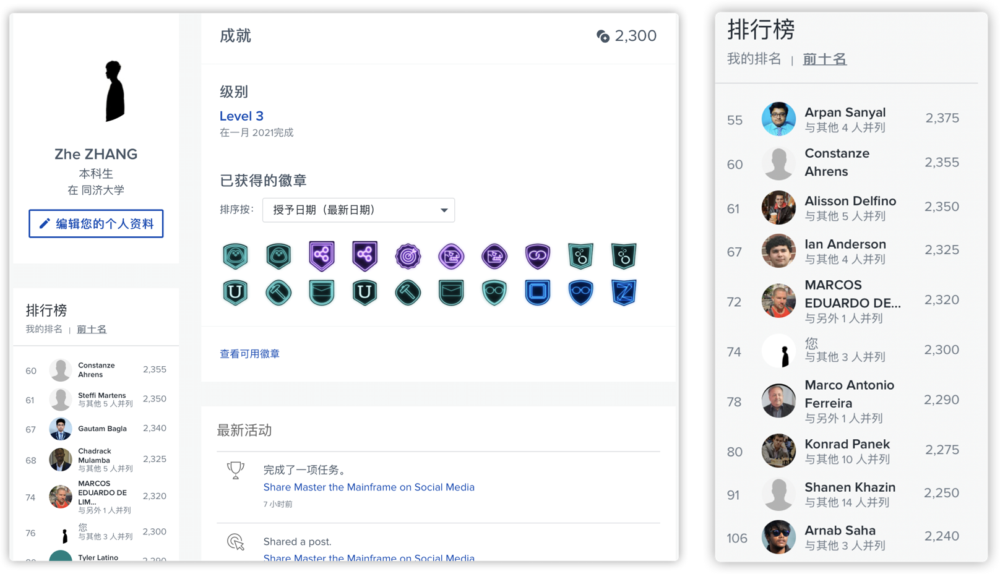
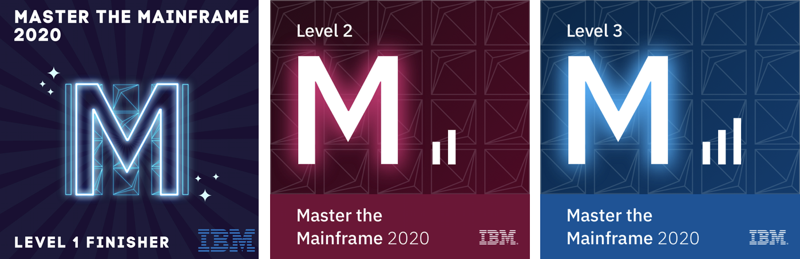

# Master the Mainframe 2020

* [Background](#background)
* [Level 3](#level-3)
* [Level 2](#level-2)
* [About the Author](#about-the-author)

------

## Background

As a green hands student who didn't learn anything about mainframe, it's my sincerely honor to have such wonderful chance to participate in the [MTM2020](https://mtm.masterthemainframe.com). And thanks for [Prof. Zhen GAO](https://sse.tongji.edu.cn/Data/View/2840) for introducing the great competition for me!

I have complete ALL tasks and win 2300 coins, **rank top 100th** (til 2021.1.17) around the world. Also I am in **Level 3**.

In the short run, I have learned some basic knowledge about Zowe CLI, Z Open Automation Utilities, Ansible, REXX, JCL, COBOL, ...

And in this repo, I want to share some core materials & codes with you.

 

## Level 3

- L3.2REXX1
  - guess number algorithm: [GUESSNUM](https://github.com/doubleZ0108/Master-the-Mainframe-2020/blob/master/Level3/GUESSNUM.rex)
- L3.3 REXX2
  - credit card number generate algorithm: [CCGEN](https://github.com/doubleZ0108/Master-the-Mainframe-2020/blob/master/Level3/CCGEN.rex)
  - output dataset: [CUST16](https://github.com/doubleZ0108/Master-the-Mainframe-2020/blob/master/Level3/CUST16)
- L3.4 CBL1
  - add JCL: [ADD1JCL](https://github.com/doubleZ0108/Master-the-Mainframe-2020/blob/master/Level3/ADD1JCL.jcl)
  - topaccets COBOL program: [TOPACCETS](https://github.com/doubleZ0108/Master-the-Mainframe-2020/blob/master/Level3/TOPACCTS.cobol)
  - topaccets JCL: [TOPACCETS](https://github.com/doubleZ0108/Master-the-Mainframe-2020/blob/master/Level3/TOPACCTS.jcl)
- L3.6 ANSB2
  - translated article: [ansb2out](https://github.com/doubleZ0108/Master-the-Mainframe-2020/blob/master/Level3/ansb2out)

 

## Level 2

- L2.9 ZOAU2
  - invalid credit card numbers algorithm: [cc_check.py](https://github.com/doubleZ0108/Master-the-Mainframe-2020/blob/master/Level2/cc_check.py)

 

## About the Author

| 姓名 \| Name👤       | 张喆 \| Zhe ZHANG                                    |
| -------------- | ---------------------------------------------------- |
| 学校 \| University🏫 | 同济大学 \| Tongji Univ.                             |
| 联系方式 \| Email✉️  | [dbzdbz@tongji.edu.cn](mailto:dbzdbz@tongji.edu.cn)  |
| 个人网站 \| Website🌐 | [https://www.doublez.site](https://www.doublez.site) |
