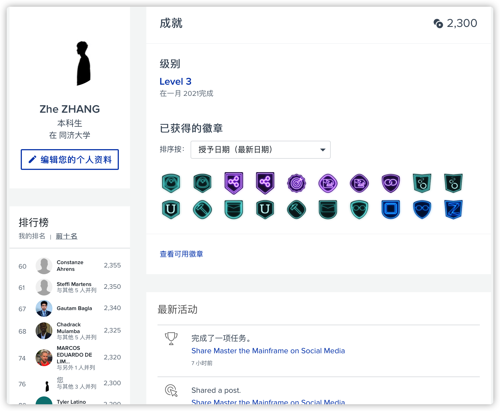

# Master the Mainframe 2020

[toc]

------

As a green hands student who didn't learn anything about mainframe, it's my sincerely honor to have such wonderful chance to participate in the MTM2020. And thanks for [Prof. Zhen GAO](https://sse.tongji.edu.cn/Data/View/2840) for introducing the great competition for me!

I have complete ALL tasks and win 2300 coins, **rank top 100th** around the world. Also I am in **Level 3**.

In this repo, I want to share some core materials & codes with you.

 

## Level 3

- L3.2REXX1
  - guess number algorithm: [GUESSNUM](https://github.com/doubleZ0108/Master-the-Mainframe-2020/blob/master/Level3/GUESSNUM.rex)
- L3.3 REXX2
  - credit card number generate algorithm: [CCGEN](https://github.com/doubleZ0108/Master-the-Mainframe-2020/blob/master/Level3/CCGEN.rex)
  - output dataset: [CUST16](https://github.com/doubleZ0108/Master-the-Mainframe-2020/blob/master/Level3/CUST16)
- L3.4 CBL1
  - add JCL: [ADD1JCL](https://github.com/doubleZ0108/Master-the-Mainframe-2020/blob/master/Level3/ADD1JCL.jcl)
  - topaccets COBOL program: [TOPACCETS](https://github.com/doubleZ0108/Master-the-Mainframe-2020/blob/master/Level3/TOPACCTS.cobol)
  - topaccets JCL: [TOPACCETS](https://github.com/doubleZ0108/Master-the-Mainframe-2020/blob/master/Level3/TOPACCTS.jcl)
- L3.6 ANSB2
  - translated article: [ansb2out](https://github.com/doubleZ0108/Master-the-Mainframe-2020/blob/master/Level3/ansb2out)

 

## Level 2